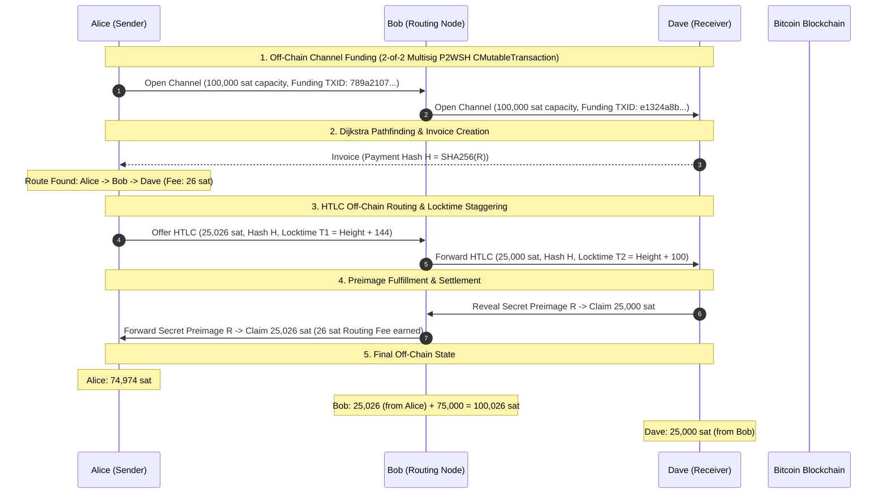

# Payment Communities — Bitcoin Micropayment Channels & Lightning Network Protocol

*Exam Project for *Blockchain, Distributed and Decentralized Systems* (INF0422)*  
**Author**: Seintian ([seintian@altervista.org](mailto:seintian@altervista.org))  
**Tech Stack**: Python 3.14+ | `uv` | `python-bitcoinlib` | `Pydantic` | `Typer` | `Rich` | `Pytest` | `Ruff`

---

## Executive Summary

**Payment Communities** implements an advanced, production-grade off-chain micropayment channel simulator and Lightning Network protocol engine on Bitcoin (Signet/Testnet/Regtest).

Transacting directly on the Bitcoin base layer (Layer 1) incurs block confirmation latency and transaction fees. Off-chain micropayment channels solve this scalability bottleneck by allowing nodes to execute thousands of real-time balance transfers off-chain, anchoring only the initial funding transaction and final settlement transaction to the Bitcoin blockchain.

### Core Architectural Features

1. **Real `CMutableTransaction` Building & Witness Stack Serialization**:
   Constructs actual SegWit v0 Bitcoin transactions (`CMutableTransaction`, `CTxIn`, `CTxOut`, `COutPoint`, `CScriptWitness`) for Funding, Asymmetric Commitments, HTLC-Success, HTLC-Timeout, and Cooperative Close transactions.
2. **Bitcoin Core `VerifyScript` Execution Verification**:
   Validates transaction scriptPubKey execution and witness stacks against standard Bitcoin consensus rules using `bitcoin.core.scripteval.VerifyScript`.
3. **Poon-Dryja (LN-Penalty) State Revocation & Breach Remedy**:
   Prevents cheating by generating per-commitment revocation secrets. Broadcasting an outdated, revoked commitment state triggers a **Justice Sweep Breach Remedy Transaction** that punishes the attacker by sweeping 100% of channel capacity to the honest node.
4. **Dijkstra Multi-Hop Pathfinding & Routing Fee Engine**:
   Constructs network topology graphs and calculates optimal multi-hop routing paths based on directional channel liquidities, routing fees (`base_fee` + `fee_rate_ppm`), and staggered timelocks ($T_1 > T_2 > \dots > T_n$).
5. **Persistent State Storage Engine**:
   Saves wallet keys, active payment channels, HTLC contracts, and revocation history across CLI invocations via JSON persistence (`.data/network_state.json`).
6. **Domain Exception Hierarchy**:
   Replaces primitive boolean flags with typed domain exceptions (`PaymentCommunityError`, `InsufficientBalanceError`, `HTLCExpiredError`, `InvalidPreimageError`, `RevokedStateBroadcastError`, `ScriptVerificationError`).

---

## Network Topology & Multi-Hop Payment Flow



---

## Bitcoin Assembly Scripts & Witness Stack Reference

For spending SegWit v0 P2WSH outputs, witness stacks are pushed to the execution stack:

| Transaction Type | Script Condition / Branch | Witness Stack Items (Bottom $\rightarrow$ Top) |
| :--- | :--- | :--- |
| **2-of-2 Multisig Spend** | Cooperative Close | `[b"", signature1, signature2, multisig_redeem_script]` |
| **HTLC Claim Spend** | Success Branch (Preimage) | `[claimer_sig, preimage, b"\x01", htlc_redeem_script]` |
| **HTLC Refund Spend** | Timeout Branch (Locktime) | `[sender_sig, b"", htlc_redeem_script]` |
| **Breach Remedy Spend** | Poon-Dryja Penalty | `[revocation_sig, b"\x01", revocable_redeem_script]` |

#### Poon-Dryja Revocable Output Script Logic

```bitcoin
OP_IF
    <revocation_pubkey> OP_CHECKSIG
OP_ELSE
    <to_self_delay> OP_CHECKSEQUENCEVERIFY OP_DROP <local_pubkey> OP_CHECKSIG
OP_ENDIF
```

---

## Repository & Project Structure

```txt
payment-communities/
├── pyproject.toml                     # UV project metadata, dependencies & pytest configuration
├── uv.lock                            # Locked dependency graph
├── .env.example                       # Environment variables template for network & WIF keys
├── README.md                          # Comprehensive project documentation & specifications
│
├── src/payment_communities/           # Clean modular source package
│   ├── __init__.py                    # Package initialization
│   ├── main.py                        # CLI Interface (Typer + Rich)
│   ├── node.py                        # Node model, wallet keys & address derivation
│   ├── channel.py                     # Channel state machine & HTLC logic
│   ├── contracts.py                   # Bitcoin Assembly script templates
│   ├── transaction.py                 # Real CMutableTransaction & VerifyScript engine
│   ├── revocation.py                  # Poon-Dryja revocation & breach remedy penalty engine
│   ├── routing.py                     # Dijkstra pathfinding & routing fee engine
│   ├── storage.py                     # JSON persistent state storage engine
│   ├── bitcoin_utils.py               # Crypto primitives, SHA256/HASH160 & Bech32 addresses
│   ├── network.py                     # Esplora REST API client (Mempool.space Signet integration)
│   ├── exceptions.py                  # Custom domain exception hierarchy
│   └── config.py                      # Pydantic environment configuration
│
└── tests/                             # Pytest suite (45 automated unit & integration tests)
    ├── test_bitcoin_utils.py          # Tests for cryptographic primitives & address derivation
    ├── test_contracts.py              # Tests for Bitcoin assembly scripts & witness stacks
    ├── test_transaction.py            # Tests for CMutableTransaction building & script verification
    ├── test_revocation.py             # Tests for Poon-Dryja revocation secrets & breach remedy
    ├── test_storage.py                # Tests for state persistence saving/loading
    ├── test_routing.py                # Tests for Dijkstra pathfinding & fee engine
    ├── test_channel.py                # Tests for channel state & domain exceptions
    ├── test_network.py                # Tests for Esplora API client & mock transports
    └── test_simulation.py             # End-to-end single-hop & timelock refund tests
```

---

## Installation & Setup

### Prerequisites

* **Python**: v3.10 or higher (Python 3.14 recommended).
* **Package Manager**: [uv](https://docs.astral.sh/uv/) (Fast Python package manager written in Rust).

### Installation Steps

1. **Clone the Repository**:

   ```bash
   git clone git@github.com:Seintian/unito-blockchain-25-26-payment-communities.git
   cd payment-communities
   ```

2. **Sync Dependencies using `uv`**:

   ```bash
   uv sync
   ```

3. **Configure Environment Variables**:

   ```bash
   cp .env.example .env
   ```

---

## CLI Execution Guide

### 1. View Configuration & Derived Addresses (`info`)

```bash
uv run payment-communities info
```

### 2. View Active Channels & State Persistence Matrix (`status`)

```bash
uv run payment-communities status
```

### 3. Run Multi-Hop Payment Simulation (`simulate`)

Executes an automated multi-hop payment routing simulation ($\text{Alice} \rightarrow \text{Bob} \rightarrow \text{Dave}$) with Dijkstra pathfinding, routing fee calculation, `CMutableTransaction` funding/close generation, and state persistence:

```bash
uv run payment-communities simulate
```

### 4. Run Poon-Dryja Breach Remedy Penalty Demo (`breach-demo`)

Demonstrates an attempted cheat where Alice broadcasts a revoked prior state, triggering Bob's automated **Justice Sweep Penalty Transaction** that confiscates 100% of Alice's channel funds:

```bash
uv run payment-communities breach-demo
```

---

## Test Suite & Quality Assurance

The project includes 45 comprehensive unit and integration tests covering transaction building, Bitcoin script verification, revocation penalties, Dijkstra pathfinding, and persistence.

### Running Pytest

```bash
uv run pytest
```

### Running Static Analysis & Code Formatting (`ruff`)

```bash
# Check code quality and linters
uv run ruff check .

# Format code according to PEP 8 standards
uv run ruff format .
```

---

## License

This project is licensed under the MIT License — see the [LICENSE](LICENSE) file for details.
