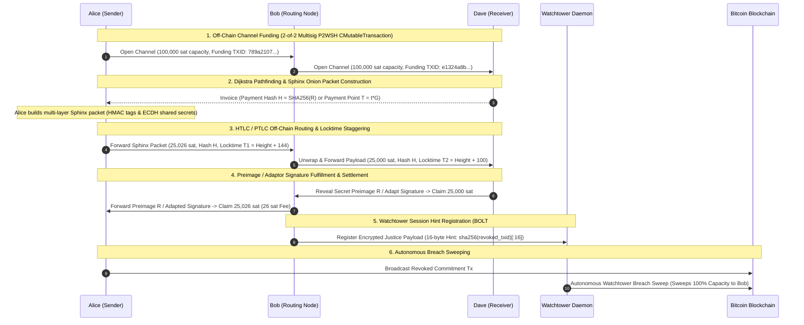

# Payment Communities — Bitcoin Micropayment Channels & Lightning Network Protocol

*Exam Project for *Blockchain, Distributed and Decentralized Systems* (INF0422)*  
**Author**: Seintian ([seintian@altervista.org](mailto:seintian@altervista.org))  
**Tech Stack**: Python 3.14+ | `uv` | `python-bitcoinlib` | `Pydantic` | `Typer` | `Rich` | `Pytest` | `Ruff`

---

## Executive Summary

**Payment Communities** implements an advanced, production-grade off-chain micropayment channel simulator and Lightning Network protocol engine on Bitcoin (Signet/Testnet/Regtest).

Transacting directly on the Bitcoin base layer (Layer 1) incurs block confirmation latency and transaction fees. Off-chain micropayment channels solve this scalability bottleneck by allowing nodes to execute thousands of real-time balance transfers off-chain, anchoring only the initial funding transaction and final settlement transaction to the Bitcoin blockchain.

### Core Architectural Features

1. **Real `CMutableTransaction` Building & Witness Stack Serialization**:
   Constructs actual SegWit v0 Bitcoin transactions (`CMutableTransaction`, `CTxIn`, `CTxOut`, `COutPoint`, `CScriptWitness`) for Funding, Asymmetric Commitments, HTLC-Success, HTLC-Timeout, and Cooperative Close transactions.
2. **Bitcoin Core `VerifyScript` Execution Verification**:
   Validates transaction scriptPubKey execution and witness stacks against standard Bitcoin consensus rules using `bitcoin.core.scripteval.VerifyScript`.
3. **Poon-Dryja (LN-Penalty) State Revocation & Breach Remedy**:
   Prevents cheating by generating per-commitment revocation secrets. Broadcasting an outdated, revoked commitment state triggers a **Justice Sweep Breach Remedy Transaction** that punishes the attacker by sweeping 100% of channel capacity to the honest node.
4. **Autonomous Watchtower Service (`watchtower.py`)**:
   Implements BOLT #13 privacy-preserving Watchtowers. Client nodes register encrypted justice payloads indexed by 16-byte hints (`sha256(revoked_txid)[:16]`). The Watchtower scans L1 block streams and automatically sweeps breach transactions without knowing node identities or un-breached channel balances.
5. **Sphinx Onion Encrypted Multi-Hop Routing (`sphinx.py`)**:
   Implements BOLT #4 Sphinx onion encryption. Multi-hop routing packets are wrapped in multi-layer ephemeral ECDH shared secrets and HMAC integrity tags, ensuring intermediate nodes only discover their immediate predecessor and successor.
6. **Anchor Outputs & Dynamic CPFP / RBF Fee Bumping (`anchors.py`)**:
   Implements BOLT #3 330 sat anchor outputs (`to_local_anchor` / `to_remote_anchor`) with 16-block CSV timelocks, enabling nodes to dynamically bump unconfirmed parent commitment transactions via Child-Pays-For-Parent (CPFP) fee bumping during L1 mempool fee spikes.
7. **Point Time-Locked Contracts (PTLCs) & Schnorr Adaptor Signatures (`ptlc.py`)**:
   Replaces SHA256 HTLC hashes with elliptic curve payment points ($T = t \cdot G$) and Schnorr Adaptor Signatures ($S' = s' \cdot G$). Enables signature-based secret release and payment decorrelation across multi-hop paths.
8. **Eltoo (LN-Symmetric) State Update Protocol (`eltoo.py`)**:
   Implements BIP 118 / SIGHASH_ANYPREVOUT symmetric update transactions ($State_1 < State_2 < \dots < State_N$). Allows newer state transactions to spend any older state transaction output without requiring penalty revocation secrets.
9. **Atomic Submarine Swaps & Inbound Liquidity Ads (`swaps.py`)**:
   Enables trustless L1 $\leftrightarrow$ L2 atomic swaps (Loop In / Loop Out) via shared HTLC preimages, as well as BOLT #7 Liquidity Advertisements for leasing inbound channel capacity.
10. **Dijkstra Multi-Hop Pathfinding & Routing Fee Engine (`routing.py`)**:
    Constructs network topology graphs and calculates optimal multi-hop routing paths based on directional channel liquidities, routing fees (`base_fee` + `fee_rate_ppm`), and staggered timelocks ($T_1 > T_2 > \dots > T_n$).
11. **Persistent State Storage Engine (`storage.py`)**:
    Saves wallet keys, active payment channels, HTLC contracts, and revocation history across CLI invocations via JSON persistence (`.data/network_state.json`).

---

## Network Topology & Multi-Hop Payment Flow



---

## Repository & Project Structure

```txt
payment-communities/
├── pyproject.toml                     # UV project metadata, dependencies & pytest configuration
├── uv.lock                            # Locked dependency graph
├── .env.example                       # Environment variables template for network & WIF keys
├── README.md                          # Comprehensive project documentation & specifications
│
├── src/payment_communities/           # Clean modular source package
│   ├── __init__.py                    # Package initialization
│   ├── main.py                        # CLI Interface (Typer + Rich) with all 8 protocol demos
│   ├── node.py                        # Node model, wallet keys & address derivation
│   ├── channel.py                     # Channel state machine & HTLC logic
│   ├── contracts.py                   # Bitcoin Assembly script templates
│   ├── transaction.py                 # Real CMutableTransaction & VerifyScript engine
│   ├── revocation.py                  # Poon-Dryja revocation & breach remedy penalty engine
│   ├── watchtower.py                  # Autonomous Watchtower daemon & encrypted hint registration
│   ├── sphinx.py                      # Sphinx onion multi-hop encrypted routing engine
│   ├── anchors.py                     # Anchor outputs & CPFP fee bumping engine
│   ├── ptlc.py                        # PTLC & Schnorr Adaptor Signature engine
│   ├── eltoo.py                       # Eltoo (LN-Symmetric) sequence update protocol
│   ├── swaps.py                       # Atomic Submarine Swaps & Liquidity Advertisements
│   ├── routing.py                     # Dijkstra pathfinding & routing fee engine
│   ├── storage.py                     # JSON persistent state storage engine
│   ├── bitcoin_utils.py               # Crypto primitives, SHA256/HASH160 & Bech32 addresses
│   ├── network.py                     # Esplora REST API client (Mempool.space Signet integration)
│   ├── exceptions.py                  # Custom domain exception hierarchy
│   └── config.py                      # Centralized protocol constants & Pydantic environment configuration
│
└── tests/                             # Pytest suite (101 automated unit & integration tests)
    ├── test_bitcoin_utils.py          # Tests for cryptographic primitives & address derivation
    ├── test_contracts.py              # Tests for Bitcoin assembly scripts & witness stacks
    ├── test_transaction.py            # Tests for CMutableTransaction building & script verification
    ├── test_revocation.py             # Tests for Poon-Dryja revocation secrets & breach remedy
    ├── test_watchtower.py             # Tests for Watchtower encrypted hints & autonomous sweeps
    ├── test_sphinx.py                 # Tests for Sphinx multi-layer onion unwrap routing & HMACs
    ├── test_anchors.py                # Tests for Anchor scripts, anchor txs, and CPFP fee bumping
    ├── test_ptlc.py                   # Tests for PTLC scripts, adaptor sigs, and secret extraction
    ├── test_eltoo.py                  # Tests for Eltoo sequence update locktimes & settlement txs
    ├── test_swaps.py                  # Tests for Submarine Swaps & Liquidity Ad fee calculations
    ├── test_storage.py                # Tests for state persistence saving/loading
    ├── test_routing.py                # Tests for Dijkstra pathfinding & fee engine
    ├── test_channel.py                # Tests for channel state & domain exceptions
    ├── test_network.py                # Tests for Esplora API client & mock transports
    ├── test_simulation.py             # End-to-end single-hop & timelock refund tests
    └── test_edge_cases.py             # 40+ boundary condition, exception & e2e lifecycle tests
```

---

## Installation & Setup

### Prerequisites

* **Python**: v3.10 or higher (Python 3.14 recommended).
* **Package Manager**: [uv](https://docs.astral.sh/uv/) (Fast Python package manager written in Rust).

### Installation Steps

1. **Clone the Repository**:

   ```bash
   git clone git@github.com:Seintian/unito-blockchain-25-26-payment-communities.git
   cd payment-communities
   ```

2. **Sync Dependencies using `uv`**:

   ```bash
   uv sync
   ```

3. **Configure Environment Variables**:

   ```bash
   cp .env.example .env
   ```

---

## CLI Execution Guide

### 1. View Configuration & Derived Addresses (`info`)

```bash
uv run payment-communities info
```

### 2. View Active Channels & State Persistence Matrix (`status`)

```bash
uv run payment-communities status
```

### 3. Run Multi-Hop Payment Simulation (`simulate`)

```bash
uv run payment-communities simulate
```

### 4. Run Poon-Dryja Breach Remedy Penalty Demo (`breach-demo`)

```bash
uv run payment-communities breach-demo
```

### 5. Run Watchtower Autonomous Breach Sweep Demo (`watchtower-demo`)

```bash
uv run payment-communities watchtower-demo
```

### 6. Run Eltoo (LN-Symmetric) State Update Demo (`eltoo-demo`)

```bash
uv run payment-communities eltoo-demo
```

### 7. Run Sphinx Onion Encrypted Routing Demo (`sphinx-demo`)

```bash
uv run payment-communities sphinx-demo
```

### 8. Run PTLC & Adaptor Signature Demo (`ptlc-demo`)

```bash
uv run payment-communities ptlc-demo
```

### 9. Run Anchor Outputs & CPFP Fee Bumping Demo (`anchors-demo`)

```bash
uv run payment-communities anchors-demo
```

### 10. Run Submarine Swaps & Liquidity Ads Demo (`swaps-demo`)

```bash
uv run payment-communities swaps-demo
```

---

## Test Suite & Quality Assurance

The project includes **101 comprehensive unit, integration, and edge-case tests** covering transaction building, Bitcoin script verification, Watchtowers, Sphinx encryption, Anchors, PTLCs, Eltoo, Submarine Swaps, Dijkstra pathfinding, and persistence.

### Running Pytest

```bash
uv run pytest
```

### Running Static Analysis & Code Formatting (`ruff`)

```bash
uv run ruff check --fix .
uv run ruff format .
```

---

## License

This project is licensed under the MIT License — see the [LICENSE](LICENSE) file for details.
