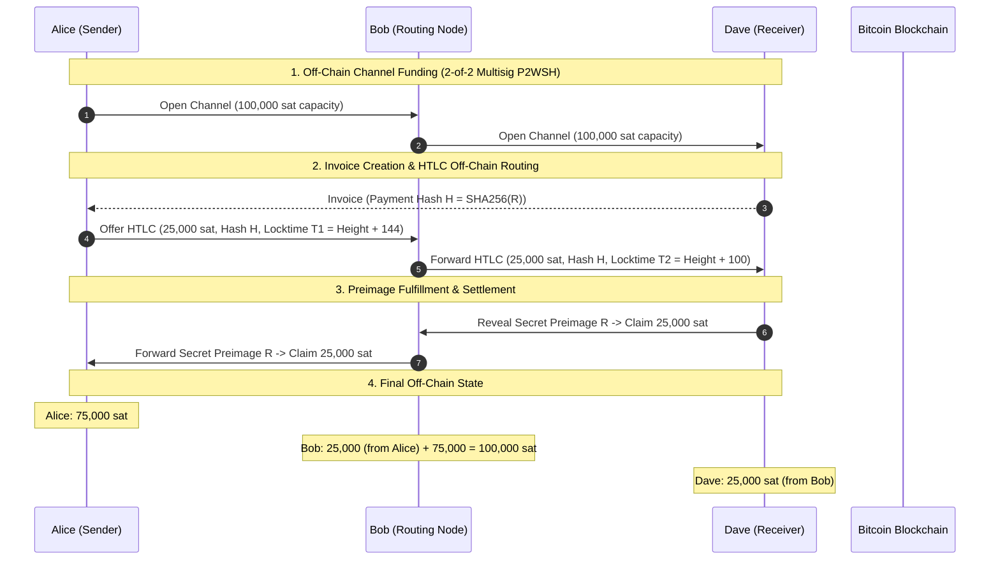

# Payment Communities — Bitcoin Micropayment Channels

*Exam Project for *Blockchain, Distributed and Decentralized Systems* (INF0422)*
**Author**: Seintian ([seintian@altervista.org](mailto:seintian@altervista.org))  
**Tech Stack**: Python 3.14+ | `uv` | `python-bitcoinlib` | `Pydantic` | `Typer` | `Rich` | `Pytest` | `Ruff`

---

## Executive Summary

**Payment Communities** implements a simplified network of unidirectional off-chain micropayment channels on Bitcoin (Testnet/Signet), inspired by the principles of the **Lightning Network protocol**.

Transacting directly on the Bitcoin base layer (Layer 1) incurs block confirmation latency and transaction fees. Off-chain micropayment channels solve this scalability bottleneck by allowing nodes to execute thousands of balance transfers off-chain in real-time, anchoring only the initial channel funding transaction (Opening) and final settlement transaction (Closing) to the Bitcoin blockchain.

This project simulates multi-hop payment routing: **Alice** can send secure micropayments to **Dave** by routing them through an intermediate node **Bob** ($\text{Alice} \xrightarrow{\text{channel}} \text{Bob} \xrightarrow{\text{channel}} \text{Dave}$) without requiring a direct channel between Alice and Dave, and without trusting Bob. Cryptographic hash locks and temporal locktimes ensure that no intermediate node can steal, freeze, or censor funds.

---

## Network Topology & Payment Flow



---

## Core Protocol Features & Cryptographic Architecture

### 1. Unidirectional Channels & 2-of-2 Multi-Signature Collateral

* **Channel Funding**: Channel collateral is locked into a 2-of-2 Multi-Signature output using SegWit v0 Pay-to-Witness-Script-Hash (`P2WSH`).
* **Redeem Script**:

  ```bitcoin
  2 <pubkey_sender> <pubkey_receiver> 2 OP_CHECKMULTISIG
  ```

* Spending requires valid ECDSA signatures from both channel peers, preventing unilateral spending without explicit script condition fulfillment.

### 2. Hashed Time-Locked Contracts (HTLCs)

HTLCs are Bitcoin smart contracts encoded in stack-based Bitcoin Script. They lock funds under a conditional disjunction:

1. **Success Branch (Hash Lock)**: The receiver can redeem the funds immediately by revealing a cryptographic secret $R$ (preimage) such that $\text{SHA256}(R) == H$.
2. **Refund Branch (Time Lock)**: If the secret $R$ is not revealed before a predefined block height (or timelock $T$), the sender can reclaim their funds.

#### HTLC Bitcoin RedeemScript Logic

```bitcoin
OP_IF
    OP_SHA256 <payment_hash> OP_EQUALVERIFY <receiver_pubkey> OP_CHECKSIG
OP_ELSE
    <locktime> OP_CHECKLOCKTIMEVERIFY OP_DROP <sender_pubkey> OP_CHECKSIG
OP_ENDIF
```

#### Locktime Staggering ($T_1 > T_2$)

In multi-hop payments ($\text{Alice} \rightarrow \text{Bob} \rightarrow \text{Dave}$):

* Alice locks funds to Bob until block height $T_1$.
* Bob forwards HTLC to Dave until block height $T_2$.
* **Requirement**: $T_1$ must be strictly greater than $T_2$ ($T_1 > T_2$). This ensures Bob has sufficient time to use the preimage $R$ revealed by Dave to claim his payment from Alice before Alice's timelock with Bob expires.

### 3. Off-Chain State Management & Dispute Resolution

* **Sequence Numbers**: Channel commitment updates increment off-chain sequence numbers.
* **Cooperative Closure**: Both nodes agree on final balance allocations and sign a settlement payout transaction returning funds to their respective on-chain P2WPKH addresses.
* **Unilateral Closure / Dispute**: If a peer becomes uncooperative, the remaining node broadcasts the HTLC transaction on-chain and claims funds after the timelock expires via `build_htlc_refund_witness()`.

---

## Repository & Project Structure

```txt
payment-communities/
├── pyproject.toml             # UV project metadata, dependencies & pytest configuration
├── uv.lock                    # Locked dependency graph
├── .env.example               # Environment variables template for network & WIF keys
├── README.md                  # Project documentation & protocol specifications
│
├── src/                       # Source code package
│   ├── __init__.py            # Package initialization
│   ├── main.py                # Main CLI interface (Typer + Rich)
│   ├── node.py                # Node model, wallet keys & on-chain address derivation
│   ├── channel.py             # Off-chain payment channel state machine & HTLC logic
│   ├── contracts.py           # Bitcoin Assembly scripts (P2WSH multisig & HTLC templates)
│   ├── bitcoin_utils.py       # Crypto primitives, SHA256/HASH160, keypairs & P2WPKH/P2WSH
│   ├── network.py             # Esplora REST API client (Mempool.space Signet integration)
│   └── config.py              # Pydantic environment configuration
│
└── tests/                     # Pytest suite (35 automated unit & integration tests)
    ├── test_bitcoin_utils.py  # Tests for cryptographic primitives & address derivation
    ├── test_contracts.py      # Tests for Bitcoin assembly scripts & witness stacks
    ├── test_channel.py        # Tests for channel state, HTLC additions & redemptions
    ├── test_routing.py        # Tests for multi-hop payment routing & balance conservation
    ├── test_network.py        # Tests for Esplora API client & monkeypatched fallbacks
    └── test_simulation.py     # End-to-end single hop payment & timelock refund tests
```

---

## Installation & Environment Setup

### Prerequisites

* **Python**: v3.10 or higher (Python 3.14 recommended).
* **Package Manager**: [uv](https://docs.astral.sh/uv/) (Fast Python package manager written in Rust).

### Installation Steps

1. **Clone the Repository**:

   ```bash
   git clone git@github.com:Seintian/unito-blockchain-25-26-payment-communities.git
   cd payment-communities
   ```

2. **Sync Dependencies using `uv`**:

   ```bash
   uv sync
   ```

3. **Configure Environment Variables**:

   ```bash
   cp .env.example .env
   ```

   *Edit `.env` to configure your target Bitcoin network (`signet`, `testnet3`, or `regtest`), API URLs, or custom WIF private keys.*

---

## Running the Application

### 1. View Project Configuration & Node Keys (`info`)

Displays active Bitcoin network settings, current block height fetched live from the Esplora API, and derived node on-chain Bech32 addresses (`tb1q...`).

```bash
uv run payment-communities info
```

### 2. View Payment Channels Matrix (`status`)

Displays a formatted status table of all active off-chain channels, capacities, sender/receiver balances, and active HTLC contracts.

```bash
uv run payment-communities status
```

### 3. Run Multi-Hop Payment Simulation (`simulate`)

Executes an automated end-to-end multi-hop payment flow ($\text{Alice} \rightarrow \text{Bob} \rightarrow \text{Dave}$):

```bash
uv run payment-communities simulate
```

*Alternative execution syntax:*

```bash
uv run python -m main simulate
```

---

## Test Suite & Quality Assurance

The project includes 35 unit and integration tests using `pytest` fixtures, test parametrization, and `httpx` mock transports.

### Running Pytest

```bash
uv run pytest
```

### Running Static Analysis & Code Formatting (`ruff`)

```bash
# Check code quality and linters
uv run ruff check .

# Format code according to PEP 8 standards
uv run ruff format .
```

---

## Witness Stack Layout Reference

For spending SegWit v0 P2WSH outputs, witness stacks are pushed to the execution stack:

| Transaction Type | Branch | Witness Stack Items (Bottom $\rightarrow$ Top) |
| :--- | :--- | :--- |
| **2-of-2 Multisig Spend** | Cooperative Close | `[b"", signature1, signature2, redeem_script]` |
| **HTLC Claim Spend** | Success (Preimage) | `[receiver_sig, preimage, b"\x01", htlc_redeem_script]` |
| **HTLC Refund Spend** | Timeout (Locktime) | `[sender_sig, b"", htlc_redeem_script]` |

---

## License

This project is licensed under the MIT License — see the [LICENSE](LICENSE) file for details.
