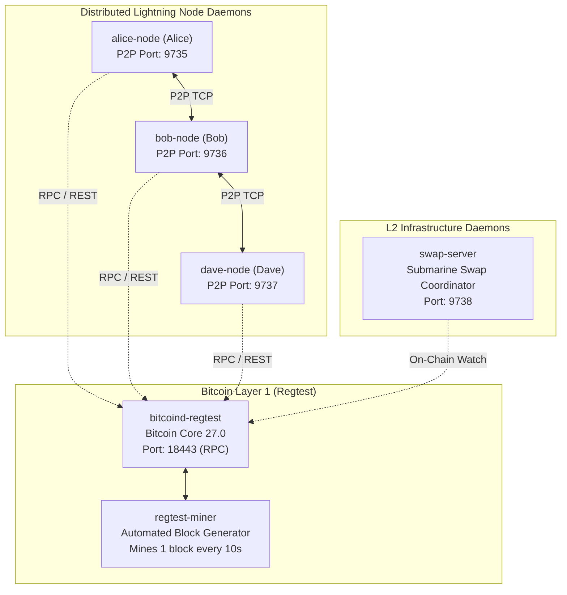

# Docker Isolated Development Environment

## 1. Architecture & Services Overview

The Payment Communities Docker environment provides a multi-container local Bitcoin network mimicking the production architecture of the Lightning Network:



---

## 2. Container Service Matrix

| Service Container | Image / Base | Internal Port | Host Port | Role |
| --- | --- | --- | --- | --- |
| `bitcoind-regtest` | `ruimarinho/bitcoin-core:27.0` | 18443 (RPC), 18444 (P2P) | `18443`, `18444` | Full validating Bitcoin node in regtest mode with `txindex=1`. |
| `regtest-miner` | Local Dockerfile | - | - | Auto-miner: mines 101 blocks to mature coinbase rewards, then 1 block / 10s. |
| `alice-node` | Local Dockerfile | 9735 | `9735` | P2P Lightning Node daemon for Alice. |
| `bob-node` | Local Dockerfile | 9736 | `9736` | P2P Lightning Node daemon for Bob (Routing intermediary). |
| `dave-node` | Local Dockerfile | 9737 | `9737` | P2P Lightning Node daemon for Dave (Endpoint recipient). |
| `swap-server` | Local Dockerfile | 9738 | `9738` | Submarine Swap coordinator daemon (Loop In / Loop Out). |

---

## 3. Quick Start Guide

### 1. Launch the Cluster

```bash
./scripts/dev-up.sh
```

This script:

1. Shuts down previous volumes cleanly.
2. Builds images and starts all 6 containers in the background.
3. Waits for `bitcoind-regtest` RPC healthcheck to pass.
4. Mines 101 blocks to unlock coinbase maturity.
5. Sends 2.0 BTC to Alice, Bob, and Dave's SegWit addresses.

### 2. Mine Blocks on Demand

```bash
# Mine 6 blocks to confirm pending mempool transactions
./scripts/mine-blocks.sh 6
```

### 3. Fund Node Wallets

```bash
# Fund each node with 5.0 BTC
./scripts/fund-nodes.sh 5.0
```

### 4. Execute Live CLI Commands Inside Containers

```bash
# Inspect channel and on-chain balance status
docker compose exec alice-node payment-communities status

# Run multi-hop simulation with live on-chain broadcasting
docker compose exec alice-node payment-communities simulate --live

# Run Poon-Dryja breach remedy penalty demo
docker compose exec alice-node payment-communities breach-demo
```
