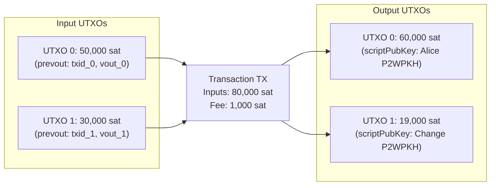
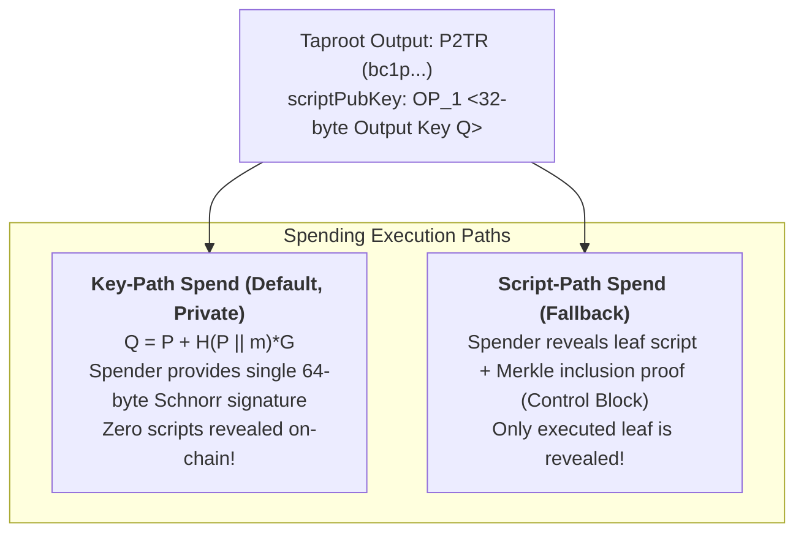

# 01. Bitcoin Layer 1 Foundations: Consensus, Scripts, and SegWit Evolution

## 1. The UTXO Model and Transaction Mechanics

Bitcoin operates on the **Unspent Transaction Output (UTXO)** accounting paradigm. Unlike account-based blockchains (such as Ethereum), Bitcoin maintains no persistent account balances in global state. Instead, value exists strictly as discrete, immutable coins called UTXOs locked by encumbrance scripts (`scriptPubKey`).

A Bitcoin transaction destroys one or more existing UTXOs (inputs) and creates one or more new UTXOs (outputs). The difference between the sum of input satoshis and output satoshis is claimed by the miner as the transaction fee:

$$\text{Fee} = \sum \text{Inputs}_{\text{value}} - \sum \text{Outputs}_{\text{value}}$$

---

## 2. The Bitcoin Script Virtual Machine

Bitcoin Script is a Forth-like, stack-based, non-Turing-complete domain-specific language. It evaluates from left to right without loops (`OP_JUMP` is intentionally omitted to guarantee execution termination and prevent DoS attacks against consensus nodes).

Validation proceeds by pushing signature scripts or witness arguments onto the evaluation stack, followed by executing the instructions in the `scriptPubKey` or `witnessScript`. A transaction input is valid if and only if the script execution terminates without errors and the top stack element is non-zero (True).

### Key Execution Opcodes for Layer 2

- `OP_CHECKSIG`: Evaluates a digital signature against a public key and transaction sighash.
- `OP_CHECKMULTISIG`: Evaluates $m$-of-$n$ threshold signatures (legacy SegWit v0).
- `OP_CHECKLOCKTIMEVERIFY` (CLTV, BIP 65): Enforces absolute timelocks; execution fails if `tx.nLockTime < stack_top` or if sequence numbers disable locktime.
- `OP_CHECKSEQUENCEVERIFY` (CSV, BIP 112): Enforces relative timelocks; execution fails if the input's relative age (in blocks or 512-second intervals encoded in `nSequence`) is less than `stack_top`.
- `OP_HASH160`: Computes $\text{RIPEMD160}(\text{SHA256}(x))$.
- `OP_SHA256`: Computes $\text{SHA256}(x)$.

---

## 3. The Transaction Malleability Problem

Prior to Segregated Witness (SegWit), a transaction's cryptographic identifier (`txid`) was calculated by hashing the entire serialized transaction payload:

$$\text{txid}_{\text{legacy}} = \text{SHA256}(\text{SHA256}(\text{version} \parallel \text{inputs} \parallel \text{scriptSig} \parallel \text{outputs} \parallel \text{locktime}))$$

Because `scriptSig` contained ECDSA signatures $(r, s)$, and ECDSA signatures are naturally malleable (an attacker or third-party node can invert $s \to N - s$ without invalidating the signature, or append dummy padding), an attacker could alter the raw bytes of `scriptSig` while a transaction was in the mempool.

This changed the transaction's `txid` without changing its spending effect. For off-chain micropayment networks (like the Lightning Network), this was fatal: **Channel commitment transactions depend on unconfirmed funding transaction outputs (`txid:vout`)**. If the funding `txid` changed before confirmation, all pre-signed child commitment transactions became permanently invalid, freezing funds.

---

## 4. Segregated Witness: SegWit v0 (BIP 141 / BIP 143)

Activated in August 2017 via BIP 141, SegWit separated (segregated) cryptographic witness proofs (`scriptWitness`) from the base transaction serialization:

1. **Malleability Fix**: The transaction `txid` is computed strictly over the base serialization *excluding* witness data. Modifying a signature changes the `wtxid`, but leaves the `txid` completely unchanged!
2. **Quadratic Hashing Fix (BIP 143)**: In legacy transactions, signing each input required hashing the entire transaction repeatedly ($O(N^2)$ scaling). BIP 143 introduced a new sighash algorithm that precomputes hash caches (`hashPrevouts`, `hashSequence`, `hashOutputs`), reducing signing complexity to $O(N)$.
3. **Weight Units & Block Size**: SegWit replaced the raw 1 MB block size limit with **Block Weight Units (WU)**. Non-witness bytes cost 4 WU per byte, while witness bytes cost only 1 WU per byte:
   $$\text{Weight} = (\text{BaseBytes} \times 4) + \text{WitnessBytes} \le 4,000,000\text{ WU}$$

### Address Types in SegWit v0

- **P2WPKH** (Pay-to-Witness-Public-Key-Hash):
  - `scriptPubKey`: `OP_0 <20-byte-hash160(pubkey)>`
  - Address prefix: `bc1q...`
  - Witness stack: `[<signature>, <pubkey>]`
  - Signature scheme: Strict canonical DER-encoded ECDSA.
- **P2WSH** (Pay-to-Witness-Script-Hash):
  - `scriptPubKey`: `OP_0 <32-byte-sha256(witnessScript)>`
  - Address prefix: `bc1q...` (longer)
  - Witness stack: `[<witness_items...>, <witnessScript>]`

---

## 5. Taproot: SegWit v1 (BIP 340, BIP 341, BIP 342)

Activated in November 2021 (block 709,632), Taproot revolutionized Bitcoin smart contracts and Layer 2 scalability:

### 1. BIP 340: 64-Byte Schnorr Signatures

- Replaces variable-length (71-73 byte) DER ECDSA with fixed 64-byte $(R_x, s)$ signatures.
- Provably secure in the Random Oracle Model.
- Strongly non-malleable.
- Native linearity enables **MuSig2** key aggregation and **Schnorr Adaptor Signatures** for PTLCs.

### 2. BIP 341: Taproot Output Derivation

Given an internal public key $P$ (e.g. 2-of-2 MuSig aggregate) and a Merkle root of alternative scripts $m$:
$$t = \text{SHA256}_{\text{TapTweak}}(P \parallel m)$$
$$Q = P + t \cdot G$$
On-chain, the `scriptPubKey` is simply:
$$\text{OP\_1} \parallel Q_x \quad (\text{Bech32m encoded as } \texttt{bc1p...})$$

### 3. BIP 342: Tapscript

Revises opcodes:

- `OP_CHECKSIG` and `OP_CHECKSIGADD` verify BIP 340 Schnorr signatures natively.
- Eliminates the legacy `OP_CHECKMULTISIG` off-by-one dummy bug.
- Removes script size limits and opcode count limits.

---

## 6. Absolute vs Relative Timelocks in L2 Channels

| Timelock Type | Transaction Field | Script Opcode | BIP | Layer 2 Function |
| --- | --- | --- | --- | --- |
| **Absolute** | `tx.nLockTime` | `OP_CHECKLOCKTIMEVERIFY` | BIP 65 | HTLC / PTLC expiration timeouts, Submarine Swap refunds |
| **Relative** | `txin.nSequence` | `OP_CHECKSEQUENCEVERIFY` | BIP 112 | Poon-Dryja `to_self_delay` dispute windows, Anchor CPFP |

- **CLTV (Absolute)**: "This output cannot be spent until Bitcoin block height $H$ or UNIX timestamp $T$."
- **CSV (Relative)**: "This output cannot be spent until $N$ blocks have been mined *after* the transaction creating this output was confirmed." This relative delay is what gives honest channel parties time to submit justice transactions before a cheater can withdraw funds.
