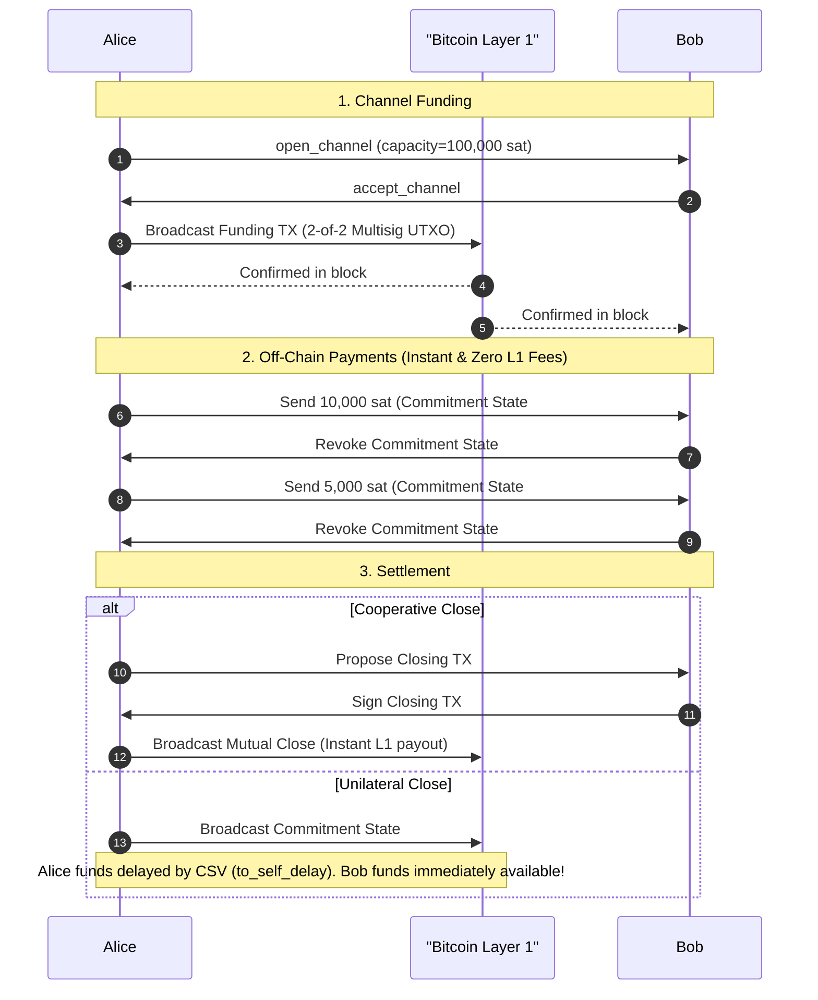
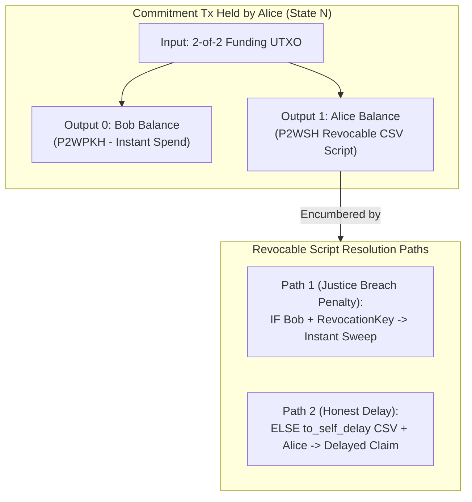

# 02. The Lightning Network: Bidirectional Channels and Asymmetric Commitments

## 1. The Scaling Imperative of Layer 2

The Bitcoin Layer 1 blockchain provides global decentralized consensus, settlement finality, and censorship resistance, but suffers from inherent physical constraints:

- Block generation rate: 1 block per ~10 minutes.
- Maximum block throughput: ~7 transactions per second globally.
- Confirmation latency: Minutes to hours for multi-block economic finality.
- On-chain footprint: Every node on Earth must validate and store every coffee purchase forever.

The **Lightning Network (LN)** solves this by moving transaction execution off-chain while anchoring dispute settlement and fund security to Layer 1. Transactions become instant, cost fractions of a satoshi, and scale to millions of operations per second without bloating the global blockchain.

---

## 2. Channel Lifecycle Overview

A bidirectional payment channel consists of three distinct phases:

1. **Funding (On-Chain)**: Both parties deposit funds into a shared 2-of-2 multisig P2WSH output on Layer 1.
2. **Off-Chain Updates (Thousands of payments)**: Parties sign and exchange off-chain balance state commitments without publishing anything to the blockchain.
3. **Closing (On-Chain Settlement)**:
   - **Cooperative Close (Mutual Agreement)**: Both parties sign a simple 2-of-2 spend paying each other their final confirmed balances with zero timelocks or disputes.
   - **Unilateral Close (Force Close)**: One party disappears or is uncooperative; the other broadcasts their latest asymmetric commitment transaction to Layer 1.



---

## 3. The Asymmetry Principle (Poon-Dryja)

If Alice and Bob shared identical commitment transactions, a malicious party could broadcast an old state where they had a higher balance, and the counterparty would have no programmatic way to prove to Bitcoin Layer 1 which transaction was newer.

The Poon-Dryja channel protocol solves this through **Asymmetric Commitment Transactions**:

- **Alice holds Commitment Transaction $C_A$**:
  - Alice's balance output is **encumbered by a delay and penalty**: Alice must wait `to_self_delay` blocks (e.g. 144 blocks / ~24 hours) via `OP_CSV` before claiming her funds, OR Bob can instantly claim 100% of Alice's balance if Bob possesses the **Revocation Key** for that state!
  - Bob's balance output is **unencumbered**: Bob receives his funds immediately via P2WPKH without any delay.
- **Bob holds Commitment Transaction $C_B$**:
  - Bob's balance output is encumbered by `to_self_delay` and Alice's revocation penalty.
  - Alice's balance output is completely unencumbered.



### The Revocable Output Script (BOLT #3)

```bitcoin-script
OP_IF
    # Breach Remedy Path: Counterparty spends immediately with revocation key
    <revocation_pubkey>
OP_ELSE
    # Honest Path: Channel holder must wait for relative delay
    <to_self_delay>
    OP_CHECKSEQUENCEVERIFY
    OP_DROP
    <delayed_pubkey>
OP_ENDIF
OP_CHECKSIG
```

---

## 4. Multi-Hop Routing Economics

When payments traverse intermediate nodes (e.g., $\text{Alice} \to \text{Bob} \to \text{Dave}$), routing nodes lock their own inbound and outbound liquidity. To incentivize channel routing, intermediate nodes charge routing fees defined by two parameters in BOLT #7:

1. **Base Fee (`base_fee_msat`)**: A flat fee charged per routed payment regardless of amount.
2. **Fee Rate (`fee_proportional_millionths`)**: A proportional fee charged per millionth of the forwarded satoshis (parts per million, ppm).

$$\text{Routing Fee} = \text{BaseFee} + \left( \text{AmountSat} \times \frac{\text{FeeRatePPM}}{1,000,000} \right)$$

In our network implementation, Dijkstra's shortest path algorithm weights each directed channel edge by:
$$\text{Weight}(u, v) = \text{RoutingFee}(u, v) + \text{CapacityPenalty}$$
ensuring optimal pathfinding with lowest fees and sufficient liquidity.
