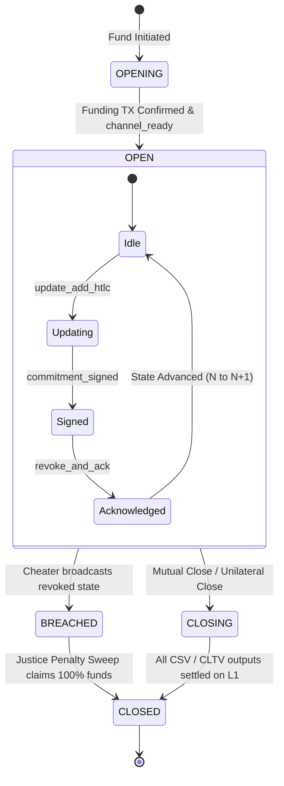
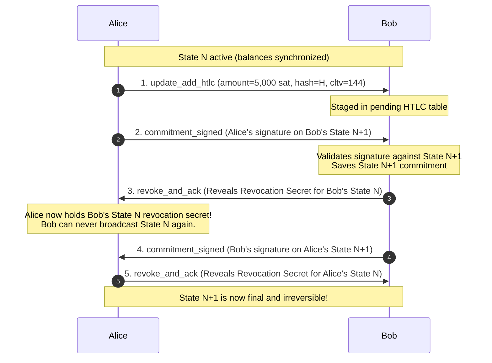
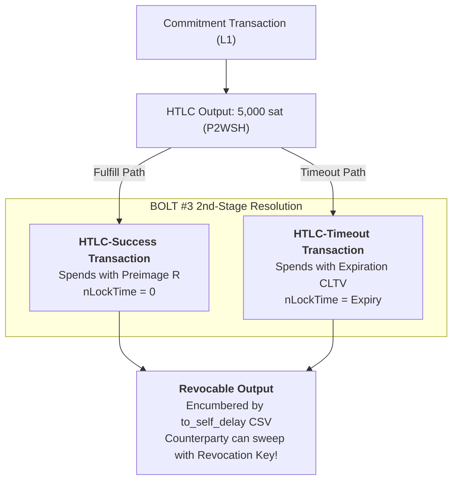

# 03. Channel State Machine & HTLC Contract Resolution

## 1. Formal Channel State Machine

Lightning channels maintain strict state synchronization across asynchronous peer sockets using a non-blocking, two-phase update protocol defined in BOLT #2.

---

## 2. Two-Phase Commitment Synchronization

To advance channel state from $N$ to $N+1$ (e.g. to add or settle an HTLC), parties must execute a synchronized 4-message exchange:

---

## 3. Hash Time-Locked Contracts (HTLCs)

HTLCs enable trustless multi-hop payment routing across chains of intermediaries without trusting any node along the path.

An HTLC enforces two mutual conditions:

1. **Preimage Success**: If the receiver presents the 32-byte secret preimage $R$ such that $\text{SHA256}(R) == H$, the receiver claims the funds.
2. **Timeout Refund**: If the expiration block height (CLTV) passes without the preimage being revealed, the sender reclaims the funds.

### The BOLT #3 2nd-Stage HTLC Vulnerability & Solution

In a unilateral force-close scenario, an on-chain race condition exists between the preimage claim and the timeout refund.

If Alice force-closes, she broadcasts her commitment transaction. If Bob has an offered HTLC with Alice:

- If Bob spent directly from Alice's commitment transaction output using the preimage, and Alice's commitment transaction is on-chain:
- A malicious Alice could wait for Bob's preimage to be broadcast, and immediately attempt to spend the refund if CLTV has elapsed!
- Even worse, if Bob publishes the revoked state, Alice must have time to execute a justice remedy on the HTLC output!

To solve this, **BOLT #3 introduces 2nd-stage HTLC Transactions** (`HTLC-Success` and `HTLC-Timeout`):

- The commitment transaction's HTLC output can only be spent by the 2nd-stage transaction.
- The output of the 2nd-stage transaction is **itself encumbered by `to_self_delay` (CSV)**!
- This guarantees that even if a party claims an HTLC on-chain, their counterparty has an undisputed window to submit a justice penalty transaction if the state was revoked!

