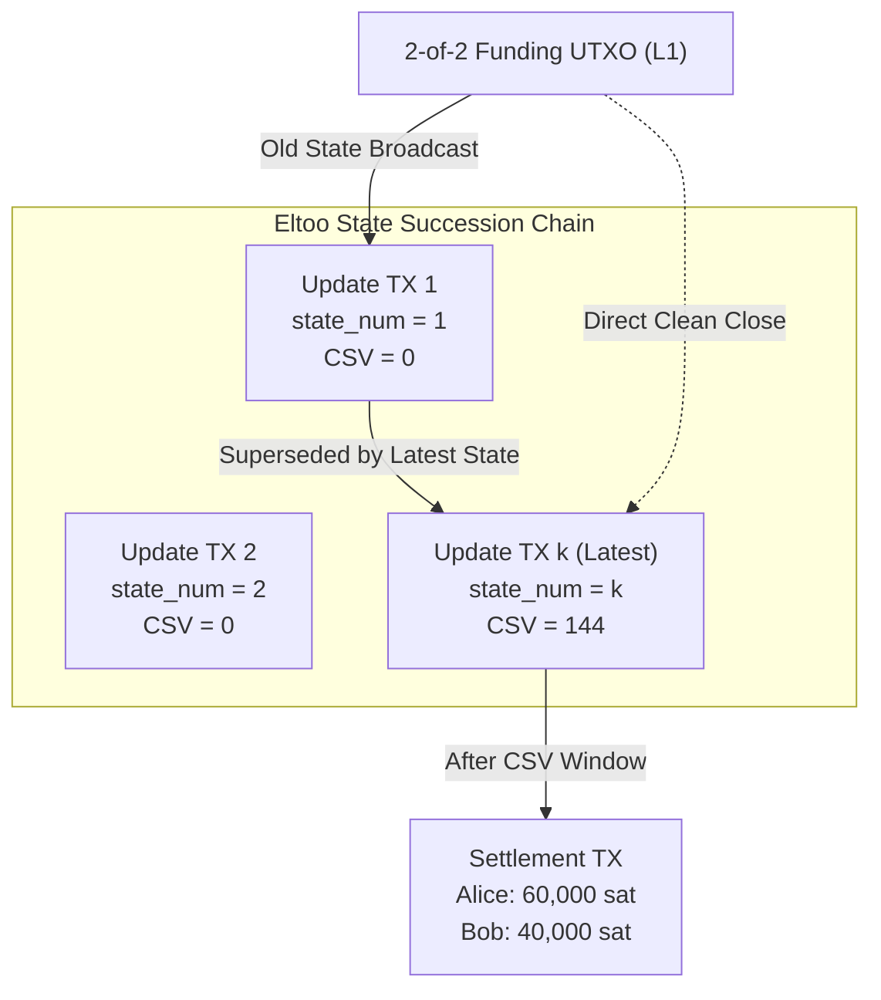
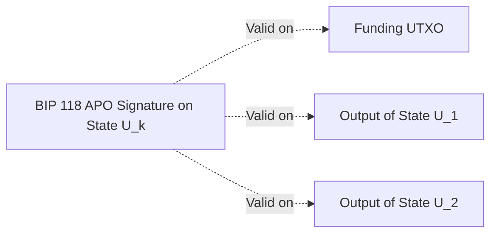

# 04. Punishment (Poon-Dryja) vs. Eltoo (LN-Symmetric)

## 1. The Toxic State Dilemma in Poon-Dryja

The Poon-Dryja punishment model is the foundation of the active Lightning Network specification (BOLT #1 - #11). While economically sound, it introduces significant operational hazards known collectively as the **Toxic State Problem**:

1. **Backup Poisoning (Catastrophic Loss)**:
   - In Bitcoin L1, restoring a wallet from a 1-month-old 12-word seed backup simply shows historical balances.
   - In Lightning under Poon-Dryja, restoring from an old backup and broadcasting a channel closing transaction will broadcast a **revoked state**.
   - The counterparty node (or watchtower) automatically detects the breach and sweeps **100% of the channel's funds**, reducing the restored node's balance to zero!
2. **Watchtower Storage Overhead**:
   - For every channel state update $N$, the client must send a new encrypted penalty transaction to the watchtower.
   - For millions of updates across thousands of channels, watchtowers must store $O(N)$ penalty blobs.
3. **Multi-Party Channel Impossibility**:
   - Poon-Dryja's asymmetric commitment model cannot scale beyond 2 parties. In an $N$-party channel, defining asymmetric punishment permutations explodes combinatorially ($N!$).

---

## 2. The Eltoo Paradigm (LN-Symmetric)

Introduced by Christian Decker, Rusty Russell, and Olaoluwa Osuntokun in 2018, **Eltoo** is a next-generation Layer 2 channel protocol that completely eliminates state revocation and punishment.

Instead of punishing cheaters, Eltoo enforces **State Replacement**:

- All channel states are symmetric (both Alice and Bob hold identical update transactions).
- If a party broadcasts an old state $U_1$, the counterparty does *not* confiscate funds. Instead, they simply publish a newer state $U_5$ directly spending from $U_1$!
- The latest state always supersedes older states on-chain, and finally spends to the settlement transaction $S$.

---

## 3. The Requirement for BIP 118 (`SIGHASH_ANYPREVOUT`)

Why can't Eltoo be deployed on Bitcoin Mainnet today?

In standard Bitcoin sighashes (`SIGHASH_ALL`), a signature commits to the specific `txid:vout` of the input it is spending.
In Eltoo, state $U_k$ must be able to spend from:

- The original Funding UTXO (if cleanly closed), OR
- State $U_1$, OR
- State $U_2$, OR
- State $U_j$ (any prior state that an uncooperative party published!).

Without knowing in advance which previous state might be broadcast on-chain, parties cannot pre-sign $U_k$ using standard sighash flags!

### The Solution: BIP 118 (`SIGHASH_ANYPREVOUT` / APO)

BIP 118 introduces a new sighash flag that **does not commit to the input transaction ID (`txid`) or output index (`vout`)**.
A signature created with `SIGHASH_ANYPREVOUT` is valid when attached to *any* input spending from an output that has the matching public key and script!

---

## 4. Architectural Comparison: Poon-Dryja vs. Eltoo

| Feature | Poon-Dryja (Current BOLT) | Eltoo (LN-Symmetric) |
| --- | --- | --- |
| **Consensus Soft Fork Required?** | None (Runs on Bitcoin L1 today) | Requires BIP 118 (`SIGHASH_ANYPREVOUT`) |
| **Commitment Symmetry** | Asymmetric ($C_A \ne C_B$) | Fully Symmetric ($U_A == U_B$) |
| **Breach Penalty** | 100% Confiscation (Punitive) | Zero penalty; latest state supersedes |
| **Toxic State Risk** | Extreme (Old backup restore = total loss) | Zero (Old backup simply triggers update) |
| **Watchtower Storage Complexity** | $O(N)$ (1 blob per state per channel) | $O(1)$ (Only 1 latest update per channel) |
| **Channel Capacity Scaling** | Strictly 2-of-2 | Scalable to $N$-party channels & factories |
| **On-Chain Settlement Overhead** | 1 transaction (Commitment TX) | 2 transactions ($U_k$ + Settlement $S$) |
