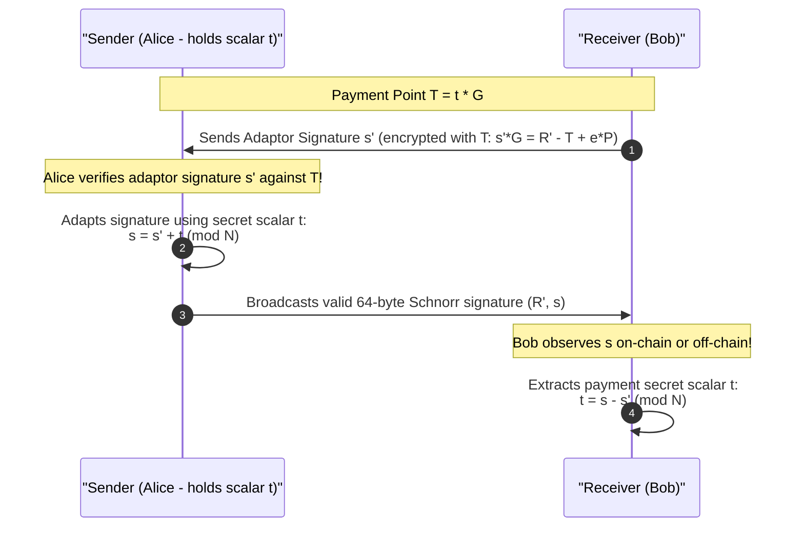
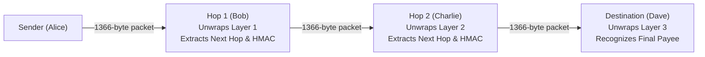

# 05. Modern Cryptography & Privacy in Layer 2 Protocols

## 1. Elliptic Curve Foundations: secp256k1

Bitcoin and the Lightning Network operate on the Koblitz curve **secp256k1** over the finite field $\mathbb{F}_p$:

$$y^2 = x^3 + 7 \pmod p$$

where:

- $p = 2^{256} - 2^{32} - 977$
- Base generator point $G = (G_x, G_y)$
- Group order $N \approx 2^{256}$ ($N$ is the total number of points on the curve).

---

## 2. ECDSA vs. BIP 340 Schnorr Signatures

| Property | ECDSA (SegWit v0) | BIP 340 Schnorr (Taproot / SegWit v1) |
| --- | --- | --- |
| **Signature Size** | 71–73 bytes (DER encoding) | Exactly 64 bytes $(R_x, s)$ |
| **Equation** | $s = k^{-1}(m + r \cdot d) \pmod N$ | $s = k + e \cdot d \pmod N$ |
| **Linearity** | Non-linear (division by nonce $k$) | **Strictly Linear** |
| **Batch Verification** | Impossible / Complex | Native ($O(1)$ scalar multiplications) |
| **Multi-Signature** | Exposes all signers in script | **MuSig2**: Single aggregated public key |
| **Adaptor Signatures** | Highly complex / fragile | **Native & Elegant** |

---

## 3. MuSig2 Multi-Signatures (Two-Round Key Aggregation)

In SegWit v0, a 2-of-2 channel requires an explicit `OP_CHECKMULTISIG` or 2-of-2 P2WSH script, revealing on-chain that the output is a Lightning channel.
With Taproot and Schnorr signatures, Alice and Bob can aggregate their public keys into a single joint public key $P_{\text{agg}}$ that looks identical to a standard single-key user address:

$$P_{\text{agg}} = \mu_1 P_1 + \mu_2 P_2$$

where $\mu_i = \text{Hash}(L \parallel P_i)$ are tweak coefficients preventing rogue-key attacks.

When spending via key-path, Alice and Bob collaborate via MuSig2 to produce a single 64-byte Schnorr signature. Observers on Bitcoin Layer 1 cannot distinguish an active Lightning channel close from a regular single-signature transfer!

---

## 4. Point Time-Locked Contracts (PTLCs) & Schnorr Adaptor Signatures

### The Privacy Flaw in HTLCs (Wormhole Attack)

In standard Lightning HTLCs, the same payment hash $H = \text{SHA256}(R)$ is forwarded across every hop on the route ($\text{Alice} \to \text{Bob} \to \text{Charlie} \to \text{Dave}$).
If Bob and Charlie are colluding (or owned by the same surveillance adversary), they can correlate the identical hash $H$ and immediately deduce that Alice is paying Dave!

### The PTLC Solution: Adaptor Signatures & Point Randomization

PTLCs replace hash locks with **Elliptic Curve Public Key Points** ($T = t \cdot G$). At each intermediate hop, the sender randomizes the payment point by adding a scalar blinding factor:

$$T_{i+1} = T_i + r_i \cdot G$$

Because each hop sees a completely different point $T_i$, payment correlation is cryptographically impossible!



---

## 5. BOLT #3 48-Order Shachain Compression Engine

In Poon-Dryja channels, a node must store the counterparty's revocation secret for every past commitment state ($0, 1, \dots, N$). If a channel executes 1,000,000 updates, storing 1,000,000 32-byte secrets requires 32 MB of persistent memory per channel.

Rusty Russell designed **Shachain** (BOLT #3) to store up to $2^{48}$ revocation secrets in at most **48 32-byte storage slots** ($O(\log N)$ space):

### The Bit-Flip Derivation Algorithm

From a single 32-byte root seed, secret for index $i$ ($0 \le i < 2^{48}$) is generated deterministically by walking through bits 47 down to 0:

```python
p = seed
for b in range(47, -1, -1):
    if (index >> b) & 1:
        p[b // 8] ^= 1 << (b % 8)
        p = sha256(p)
return p
```

### Compact Tree Storage Properties

- When a secret is revealed, if it shares an ancestor with an existing slot in the receiver's tree, the child is compressed into the parent ancestor slot.
- **Space Complexity**: Maximum 48 storage slots $\times 32$ bytes $= 1,536$ bytes total forever!
- **Time Complexity**: Generating secret at sender is $O(1)$ ($48$ iterations). Deriving any past secret at receiver is $O(\log N)$ ($< 48$ hashes).

---

## 6. BOLT #4 Sphinx Onion Routing

Sphinx is the privacy-preserving packet encryption format used by Lightning to route payments through multiple intermediaries without revealing:

- Who the original sender is.
- Who the final recipient is.
- How many hops the route contains.
- The total length of the payment path.



### Packet Structure (Exactly 1366 Bytes)

- `version`: 1 byte (`0x00`).
- `ephemeral_key`: 33 bytes (compressed secp256k1 public key $E_i$).
- `routing_info`: 1300 bytes (encrypted payload layers).
- `hmac`: 32 bytes (HMAC-SHA256 integrity tag).

### Key Blinding & Filler Generation

- At each hop $i$, the node blends the ephemeral public key:
  $$E_{i+1} = b_i \cdot E_i \quad \text{where } b_i = \text{SHA256}(E_i \parallel ss_i)$$
- As each hop strips its 65-byte hop payload and shifts left, it pads the right with pseudo-random bytes generated via ChaCha20 stream cipher.
- The sender pre-calculates the filler so that after all shifts and XORs, each hop receives the exact expected routing info and valid HMAC tag.
